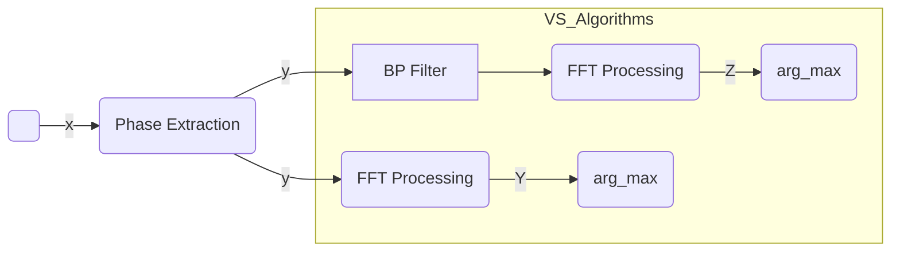

# Activities 

## [W17 | 23.04.23 - 23.04.29 ]  

### Development

### Algorithm Survey
- 차량용 FMCW 레이다 시스템 시뮬레이터 개발(2020 한국자동차공학회 춘계학술대회, 노태건, 남상욱)
- 

### Product Plan
- 사내 현대차 담당 (전략영업 김상원Pro) 협의 내용 정리
  + A spl은 있어야 한다.
  + tear down을 통한 시스템 개선 point 수립, 구현 방안(나의 강점은 이것이다...) 수립
  + T-1 업체(모비스, 만도 등)를 만나서 방향 확인도 필요

---

## [W16 | 23.04.16 - 23.04.22 ]  

### 지능형 레이더 기술동향, 전자통신동향분석 제36권 제2호 2021년 4월  
- Applications  
  + 지능형 모센센싱: 조명 제어, 자동 문 개폐, 보안 경보 등
    - laptop, speaker, tablet등의 시스템에 움직임 감지용
    - XENSIVTMBGT60LTR11AIP(인피니언, 60GHz, 도플러모션센서)
  + 트래픽 Monitoring  
  + 드론/PAV(Personal Air Vehicle) 자율비행  
    - 한국형 도심항공교통(K-UAM) 로드맵 겈토 필요함.
    - 카메라, 레이더, 라이다 등을 모두 포함하는 고도의 센싱 기술, AI 기술, 네트워크 기술 필요
    - Issues: 주변상황을 판단해 통제할 수 있는 기술과 안정성, 무게, 배터리 용량, 소음, 항공 교통 정리와 인프라 기술
      + 사람/사물 구분, 
  + 드론탐지
    - 미세도플러를 이용한 특성벡터를 추출하여 드론과 새 구분
    - [무인비행체용 지상탐지 레이더 개발](https://scienceon.kisti.re.kr/srch/selectPORSrchReport.do?cn=TRKO202100006659) 보고서 참조
    - [저고도 소형드론 식별·주파수 운용요구 및 제도개선 사항 도출 연구](https://www.rra.go.kr/FileDownSvl?file_type=research2&file_parentseq=1169&file_seq=1) 보고서 참조
  + 재난환경 인명탐지 레이더

---  

### Radar Promotion 자료 초안 수립

---  

### 60GHz Radar 측정
- [표적 시뮬레이션 솔루션](https://www.dspace.com/en/pub/home/products/systems/darts/use-case-in-cabin-monitoring.cfm) 검토 필요

## [ W10 ] 23.03.06 ~ 03.12  

- mmWave_toolbox 검토  
	1. 실행 절차
		1. python pymmw.py -c COMㅁ -d COMㅁ (@ cmd windwo) :-c는 control port, -d는 data port
		2. NRST button press

	2. 동작
		1. 오류 
			+ 증상 : "x8..." 파일이 실행되어야 하는데, "14_capture.py" 가 실행됨
    		+ 원인 :  
    			- pymmw.py에 meta 딕셔너리에서 코드 실행 목록을 작성하는데, 이 파일의 내용이 비어있음
    			- _init_의 'fw'  
    				: scripy path 수정 필요  
    			- x8_mmw.py  
    				: meta 딕셔너리에 'ver' 항목이 3.4.0.3과 3.5.0.4 2개임  
                    : mss 폴더에 있는 파일들 중 6843 이외의 파일들을 새폴더로 이동 후 처리 과정 확인
    			- prj build 환경은 3.6.0.0 ---> ver에 3.6.0.0 추가  

- 산베 startup 강의 (3/6)
	1. 투자 appel 요소로 객관적 지표(특허, 수상 등)와 사업기획서 작성이 중요하며, 이익률보다 매출이 더 중요하다.
	2. 스타트업이 고민해야할 것들로는
		- 내부 요소(자금 조달, 경영관리, item)과 외부 요소(시장, 경기변화/법률문제) 이 있음
		- 시장 상황, 인력 수급 등 
	3. C-Lab 예
		- spin-off(30%) 와 사내 사업화 (70%) 중 사내 사업화는 소멸되었음

- baseline Prj 선정 test  
1. Out Of Box demo :
 
| Toolbox 		| EVK			| 		bin					| Execution	|  
| ---			| ---			| ---						| ---		|  
| ATB3.6.0		| 6843ISK_ODS	| OOB_6843_AOP  			|   X		|  
|				| 	  	//		| OOB_6843_ISK(custom build)|   O		|  
|				| 		//		| OOB_6843_ISK(pre build)	|   O		|  

2. Occupancy Detection :  

| Toolbox 		| EVK			| 		Bin					| cfg		| Execution	|
| ---			| ---			| ---						| ---		|  ---		|
| ATB3.0.0, overhead_mount_occupancy | 6843ISK_ODS | overhead_3d_vod_demo.bin (overhead_3d_vod_68xx_) | vod_6843_ods_overhead_5zones.cfg | O |

---

## [ W11 | 23.03.13 ]   

- overhead mount OD를 위한 Reference 선정
	1. A_TB_360/incabinSensing/OverheadMountVOD
		1. prebuilt & prjbuilt 동작 확인 
		2. cfg parameter 정리 & 주요 parameters define

--- 

### [ W12 | 23.03.20 ]  

[ICT Global Market Analysis_품복별 ICT 시장 동향_디지털헬스케어](https://www.globalict.kr/upload_file/kms/202206/77023198779932069.pdf)
- 선도 기업 : Availity, SWORD Health, Maven
 	- Availity
 		+ 보험 청구 서비스, 전자 의료 기록 소프트웨어 구현, 교육 등을 포함한 의료 서비스 제공자의 진료
및 병원 운영 간소화에 필요한 서비스 제공
		+ 공급자가 원하는 형식과 구조로 건강플랜에 대한 업데이트 및 다중 채널 통신 없이 공급자 네트워크에 실시간 건강정보 전달
        + 보험회사와 의료 제공자 연결플랫폼
        + 환자 보험 확인 및 혜택, 청구관리 및 프로세스 간소화 서비스
 	- SWORD Health
    	+ 디지털 물리치료(근골격 치료 솔루션)
        + 여성 골반 통증 치료 솔루션
        + 전문가 채팅 서비스
 	- Maven
		+ 출산(불임치료), 임신, 입양, 양육 및 소아과 전반 온라인 의료 서비스(재정설계 및 지원서비스 포함)
        + 워킹맘 모유수유 솔루션(모유 배송, 모유 수유 상담원 서비스 및 부고 교육)
- 유망 기술 : 모바일헬스, 인공지능, 개인건강정보, 사물인터넷, 원격환자모니터링
	- 모바일헬스
	- 인공지능
	- 개인건강정보
	- 사물인터넷
	- 원격환자모니터링  

#### 23.03.23
사업계획서 작성 멘토링 온라인 미팅(김성일대표)  

  * 주기적 미팅 임  
  - 가치제안 시 추가 할 사향 정리 필요  
  - Functional test 이전에 VOC 청취 필요  
  - 문서상으로는...레이더 원리, 감지방안, 차별화포인트 설명됨  
	동일 레이더 방식 대비 차별화 방안이 없어 보임  
	(YJ: 인케빈 레이더 장착 차량 섭외 및 기능 test 진행 필요)   
  - 2차년도에 추가로 더 할 수 있을 기능 등 list-up 필요한데...   
  - 선행 연구 등이 병행도 가능한가? 검증 방법 등 구체화 필요.  
  - 차별화 포인트가 보이지 않음.  

	고객들이 원하는 것을 만들고 있는지...  
	레이더가 다른 방식에 비해 장점은...또는 내가 만드는 제품이 무엇이 다른지... 등  
	고객사에 제안을 할때 어떤 이점이 있는지, 시너지를 낼 수 있는 것은(당사 제품 등)?  

Paper [Radar-Based Monitoring of Vital Signs: A Tutorial Overview](https://ieeexplore.ieee.org/abstract/document/10049295)
- 리뷰 중

---

## [ W13 | 23.03.26 ~ 23.04.01]  

* ODVS gui 구현
	- ODVS packet parsing (3/27, heatmap, decision 완료, Heart Breathing Rate packet 구조 파악 중)
    - ODVS graph 구현
    - vital sign (Ti heart breathing rate 계산 원리 및 알고리듬)
    - vital sign (new heart breathing rate 계산 원리 및 알고리듬)
    
* MCW2023에 나타난 ICT 트랜드 전망 (3/28)
	- 통신 업체(ESG관련): 대규모 MIMO가 실회 고정 무선 네트워크에서 30~50%의 에너지 절감 달성 가능
    - 헬스/제조/스마트모빌리티
    	+ 화웨이:4가지 의료 시나리오 기반 솔루션
    	+ 오포: 오헬스h1가족건강모니터기기
    	+ 페가트론: 스마트팻토리용 5g Apps
    	+ 에릭슨: 자율주행차스타업(Vay)과 5G 원격주행기술 시연(도어투도어 서비스)
    
* 로봇을 만나는 새로운 방법 ‘RaaS', 검토 필요함    
    
---

## [W14 | 23.04.2 - 23.04.08]  
### - OOB output Diagram 
+ heatmap 완료
+ detected point와 range profile 그래프가 깜박이는 현상 수정 완료
  - data parsing 후에 draw plot을 하게되면, rangeprofile이 깜박임
  - heatmap과 range profile을 나누어서 그림(detected point와 range profile은 parsing 중간에 그리고, heatmap은 parsing 완류 후에 그리도록 수정  

### - NLOS 산학과제 중간리뷰
+ 4/20일 진행
+ 4/17일까지 문서 송부 예정. 송부된 문서를 토대로 마케팅팀장 보고
+ SW혁신센터 요청사항 : 로드맵 수정 필요
	
### - [유야 감지 센서 속속 제안_일본업체 중심](https://hjtic.snu.ac.kr/board/news_summary/view/9260)

### - Radar-Based Monitoring of Vital Signs: A Tutorial Overview
- Useful Apps: 
	+ estimation of HR
	+ identification of anomalous alterations of heart beats
	+ simultaneous observation of the vital signa of multiple people
- SISO/MIMO architecture
    + CW Doppler radar
    + FMCW radar
    + SFCW radar
	    
- Algorithms of VS

- Modeling of Chest Displacemennt (estimation of HR)
	+ 현상 : 사람의 심장박동에 의한 진동이 흉부 호흡 운동과 중첩된다. 
	+ 흉부 호흡 운동과 심장 진동 모두 고정된 거리에서 레이더 시스템에 의해 측정 가능
	+ displacement $\Delta(t)$ chest surface measured by the radar system  
	$$\Delta R(t) ≜ R(t) - R_0 = \theta_b(t) + \theta_k(t) $$  
    $R(t), R_0$ : radar–chest distance at time t (distance in the absence of respiration)  
    $\theta_b(t), \theta_h(t) : breath (heart) contribution to ΔR(t)  
    + 다음 조건이 유지된다는 점이 중요함.  
       - a. 변위(\theta_b(t) (\theta_h(t)))는 주기적임  
       - b. 변위 ΔR(t)에 대한 $\theta_h(t)의 기여도는 $\theta_b(t)에 비해 적다.  
       $\theta_(b,M), \theta_(h,M)$은 $\theta_b(t) (\theta_h(t))의 max 절대값  
       $ 1 ≤ \theta_(b,M) ≤ 5cm $ and $ 1 ≤ \theta_(h,M) ≤ 9cm $  

- 각각의 주기내에서 breath displacement(호흡변위) $\theta_b(t)$의 수학적 모델[^1]
    + the displacement in the inspiration phase is described by the parabolic profile
	      수식 2 참조
    + expiration phase
	      수식 3 참조

- Signal Processing Algorithm for VS
	+ Deterministic Detection & Estimation Algorithms (SISO base)
		- 레이더 기반을 통해 얻어지는 Vital Sign은 결정론적(deterministic[^2] model)임
		- 수신 신호의 phase에서 VS 추출
		$ ψ[n] ≜ ψ0 + Δψ[n] $ : DC-Offset, n번째 수신신호 샘플에 대해...
        $ Δψ[n] = (4π/λ)ΔR[n] $ : 호흡과 심장 활동에 의해 유발되는 신체 움직임과 관련된 시간에 따른 변화와 관련된 값  
        
        - CW Doppler radar 기반 deterministic 방법에 의해 구현  
          + 수신 신호로부터 위상 추출(모델 수립 필요)

      
      
	  - phase extraction is carried out by the first block, which generates the Nr-dimensional vector(generated by ˆψ) 

	+ Estimation Algorithms (MIMO base)

---

## [W15 | 23.04.09 - 23.04.15]

### - OOB output
- 1) range profile 기능 보강 : CFAR threshold 값 이상의 경우만 symbol 표시
- 2) heatmap x축과 y축이 바뀐 듯.  
  ※ 1)과 2)를 이용하여 ODVS 구현 필요

### 최소 자승법을 이용한 고해상도 밀리미터파 탐색기의 비선형 위상 오차의 추정
- Sweep Nonlinearity Estimation for High Range Resolution Millimeter-Wave Seeker Using Least Squares Method, 2011.10.31  

- Abstract
	- FMCW/FMICW 시스템의 비선형특성에 의해 발생되는 거리 해상도 성능 저하 현상을 보상하기 위하여 비선형 위상오차 성분 모델링 및 비선형성을 추정할 수 있는 신호처리 알고리듬 제안
	- 알고있는 거리에 위치한 두개의 기준점 목표물로부터 최소 자승법 관점에서 최적 해로서의 비선형 오차 성분을 추정하는 기법으로, 추정된 비선형 오차성분은 비선형 오차 특성 보상을 이한 서전 왜곡(predistortion) 기법을 위해 사용될 수 있음

### 양자통신 표준화의 현황과 과제
- ICT Standard Weekly 제1129호
- 23.04.14
- 양자 암호키 분배(QKD, Quantum Key Distribution)
- 양자통신(양자 암호 통신이라고도 하며, 통신망 관점에서는 양자암호키 분배망이라고 함) 시작: 
  + Tx) 편광판 2 개와 1개의 미트를 나타내는 편광 상태를 미리 정의한 뒤 메시지를 담은 임의의 비트를 양자 채널을 통해 편광시켜 보낸다. 편광에 따라 광자 신호는 수신자의 편광필터로 전달됨. 송신자가 보낸 광자 신호는 물리적으로 편광에 의한 난수가 발생.
  + Rx) 송신단에서 정보를 알랴주면, 수신단의 필터가 동일한지 검증을 거친 다음 비트 보관.
  + 송/수신자는 공개 채널을 통해 결정한 비트값을 공유하고, 이것을 암호로 활용  
  

--- 

         
[^1]: A. Albanese, L. Cheng, M. Ursino, and N. W. Chbat, “An integrated mathematical model
of the human cardiopulmonary system: Model development,” Amer. J. Physiol.-Heart Circulatory
Physiol., vol. 310, no. 7, pp. H899–H921, Apr. 2016.  
[^2]: 예측가능함, model 기반 시스템임

