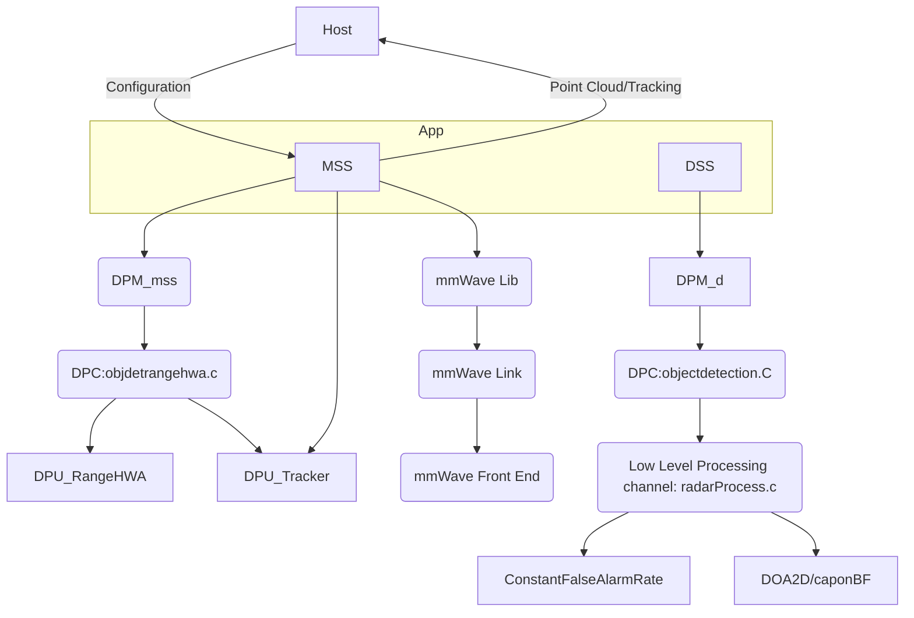

※ flow chart of 3D People Counting Demo Implementation using mmWave SDK components.  

 

## 1.1. Application (3D People Counting Application Level)  

Application is split between MSS and DSS. DSS and MSS call the DPM APIs through which they control the configuration and execution of DPCs.  
MSS also controls the radar front end, and communicates with the Host.  
---  

## 1.2. mmWave Lib  

The mmWave Lib module is a higher layer control running on top of mmWaveLink and LLD API (drivers API).  

    mmWave Lib module은 mmWaveLink와 LLD API(드라이버 API) 위에서 실행되는 상위 제어 계층이다.  

  

radar fem을 control하는 App을 위한 API set을 제공한다.  
mmWave module은 R4F (MSS)에서만 실행한다.
---

## 1.3. mmWave Link  
control layer  

--- 

## 1.4. Data-path Manager (DPM)  

---

# Code Review  

- Pcount3DDemo_dssInitTask
  + 'ptrProcChainCfg'에 gDPC_ObjectDetectionCfg (프로세스 체인 구조체[^procChainCfg]) 정의

- gDPC_ObjDetRangeHWACfg   
  : ~~objdetrangehwa.c in '..\common\dpc\objdetrangehwa\src' (Global used to register Object Detection DPC in DPM)~~  
  : 

- DPC_ObjectDetection_execute [^DPC_ObjectDetection_execute]  
  + DPU_RangeProcHWA_process (in objdetrangehwa.c)
  + DPU_radarProcess_process
    - rangeProcHWA_dcRangeSignatureCompensation ("calib DC processing"이 enable 조건에서)

---
[^ procChainCfg]: objewctdetection.c in '..\common\dpc\capon3d\src'에 선언되어 있음  
[^DPC_ObjectDetection_execute] : relation이 3곳 나타남, 파일은 동일
